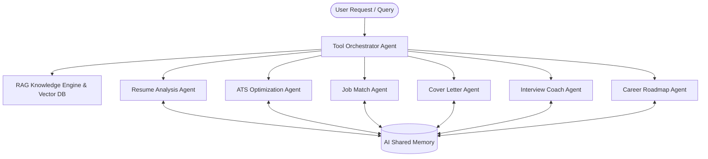

# AI Resume & Career Advisor 🚀

An intelligent, multi-agent full-stack career platform designed to empower job seekers, students, and professionals with AI-driven resume analysis, ATS compatibility scoring, automated application generation, real-time mock interviews with voice feedback, and dynamic career roadmapping.

Built with **React 19**, **Tailwind CSS v4**, **Node.js & Express**, and powered by **Google Gemini AI (`@google/genai`)** with semantic **Retrieval-Augmented Generation (RAG)**.

---

## 🌟 Key Highlights & Core Capabilities

- 🤖 **Autonomous Multi-Agent Architecture**: A coordinated system of specialized AI agents working together through an intelligent tool orchestrator.
- 🎯 **ATS Compatibility & Metric-Driven Scoring**: In-depth parsing and evaluation of resumes against industry standards, ATS algorithms, and job specifications.
- 📄 **Interactive AI Resume Builder**: Live visual editor with customizable modern templates, instant AI bullet rephrasing, and high-resolution PDF/DOCX export.
- 🔍 **Semantic Job Description Matcher**: Real-time keyword gap analysis, skill alignment scoring, and tailored resume optimization advice.
- ✉️ **Custom Cover Letter Synthesizer**: Role-specific, tone-adjusted cover letter generator with instant markdown preview and copy tools.
- 🎙️ **Mock Interview Studio**: Interactive mock interview coach with voice synthesis (TTS), STAR-method response evaluations, and real-time grading.
- 🗺️ **Personalized Career Roadmaps**: Multi-week visual skill progression plans with recommended courses and project milestones.
- 🧠 **Cross-Session AI Memory & Long-Term Context**: Persistent memory tracking user strengths, target roles, interview histories, and previous resumes.
- 📚 **Vector Grounded RAG Knowledge Base**: High-dimensional semantic retrieval over career rubrics, action-verb databases, and recruiter benchmarks.
- 🛡️ **Resilient Model Circuit Breaker**: Dynamic model health rotation across `gemini-3.7-flash`, `gemini-3.1-flash-lite`, and fallback heuristics for zero downtime.

---

## 🏗️ Multi-Agent Ecosystem



### Specialized Agents Overview

| Agent | Responsibility | Core Output |
|---|---|---|
| **`ToolOrchestratorAgent`** | Central coordinator managing multi-turn dialogue, tool calling, query classification, and dynamic sub-agent dispatch. | Unified conversational responses, tool execution traces. |
| **`ResumeAnalysisAgent`** | Analyzes resume structure, quantifiable impact metrics, action verbs, and section completeness. | ATS score (0-100), identified strengths, structural weaknesses, bullet improvements. |
| **`ATSOptimizationAgent`** | Deep parsing of keyword density, parsing risks (tables/graphics), contact completeness, and readability. | ATS readiness breakdown, keyword optimization recommendations. |
| **`ResumeBuilderAgent`** | Synthesizes polished resumes tailored to specific roles from raw experience, with live layout updates. | Structured resume JSON, live PDF rendered templates. |
| **`JobMatchAgent`** | Compares candidate credentials directly against target job descriptions and industry requirements. | Alignment score %, matching skills, missing skills, bullet revisions. |
| **`CoverLetterAgent`** | Crafts personalized cover letters adapting to chosen tones (*Professional*, *Enthusiastic*, *Technical*, *Concise*). | Formatted markdown cover letters, keyword alignment indicators. |
| **`InterviewCoachAgent`** | Conducts interactive behavioral & technical mock interviews with audio questions and STAR feedback. | Question audio synthesis, STAR criteria scores (0-10), model answers. |
| **`CareerAdvisorAgent`** | Builds customized multi-week learning roadmaps tailored to current vs target skill gaps. | Structured week-by-week timeline, learning milestones, project ideas. |
| **`AIMemoryManager`** | Persists user profile context, past resume snapshots, feedback items, and interview scores across tools. | Session memory state, personalized recommendations. |

---

## 🖥️ Platform Modules & Views

1. **Executive Dashboard (`DashboardView`)**
   - Overall career readiness index, recent resume uploads, quick-action tiles, and interview performance metrics.
2. **Resume Analyzer (`ResumeAnalyzerView`)**
   - File upload (PDF, DOCX, TXT), instantaneous parsing, ATS breakdown radar, section checks, and bullet-point rewrites.
3. **Interactive Resume Builder (`ResumeBuilderView`)**
   - Rich section editors (Work History, Education, Projects, Skills, Certifications), AI bullet enhancer, theme customizer, and one-click PDF generation.
4. **Job Matcher (`JobMatcherView`)**
   - Direct side-by-side job description comparison, semantic keyword highlighting, and targeted application suggestions.
5. **Cover Letter Generator (`CoverLetterView`)**
   - Style-driven letter synthesizer with live preview, copy-to-clipboard, and downloadable PDF/text outputs.
6. **Mock Interview Studio (`InterviewCoachView`)**
   - Role-based question generator, audio readout (TTS), voice/text answer submission, and STAR metric scorecard.
7. **Career Roadmap (`CareerAdvisorView`)**
   - Interactive milestone timeline, skill difficulty meters, estimated weekly effort, and curated resource links.
8. **Multi-Agent Orchestrator (`AgentChatView`)**
   - Real-time agent chat interface visualizing autonomous reasoning steps, tool dispatches, and knowledge retrieval.
9. **College & Placement Portal (`CollegeDocsView`)**
   - Specialized document templates, placement drive preparation guides, and academic-to-industry transition tools.
10. **AI Memory (`AIMemoryView`)**
    - Inspect and manage long-term agent memory, past resume records, interview history, and user skill profiles.
11. **Admin Analytics (`AdminPanelView`)**
    - Platform telemetry, model usage latency statistics, quota tracking, and audit logs.

---

## 🛠️ Technology Stack

### Frontend
- **Framework**: React 19 + TypeScript
- **Bundler**: Vite 6
- **Styling**: Tailwind CSS v4 with custom dark/light theme tokens
- **Animations**: `motion` (Framer Motion engine)
- **Icons**: `lucide-react`
- **Charts & Visualizations**: `recharts`
- **Export & Document Parsing**: `jspdf`, `html2canvas`, `pdf-parse`, `mammoth`

### Backend & Middleware
- **Runtime**: Node.js (ESM / TypeScript via `tsx`)
- **Server Framework**: Express 4
- **Security & Reliability**: `helmet`, `express-rate-limit`, CORS configuration
- **Compilation**: `esbuild` for production server bundling (`dist/server.cjs`)

### AI & Vector Grounding
- **LLM SDK**: `@google/genai` (Google Gemini SDK)
- **Active Models**: `gemini-3.7-flash`, `gemini-3.1-flash-lite`, `gemini-flash-latest` with automatic health rotation
- **Vector Search / RAG**: In-memory high-dimensional embeddings and ChromaDB vector store support

---

## 🚀 Getting Started

### 1. Prerequisites
- **Node.js**: v18.0.0 or higher
- **npm** or **bun** / **yarn**
- **Gemini API Key**: Obtainable from [Google AI Studio](https://aistudio.google.com/)

### 2. Installation

Clone the repository and install all dependencies:

```bash
git clone https://github.com/your-username/ai-resume-career-advisor.git
cd ai-resume-career-advisor
npm install
```

### 3. Environment Configuration

Create a `.env` file in the root directory (based on `.env.example`):

```env
# Google Gemini API Key for AI Agents
GEMINI_API_KEY=your_gemini_api_key_here

# Optional: Server Port (Defaults to 3000)
PORT=3000
```

### 4. Running in Development Mode

Start the integrated Express + Vite development server:

```bash
npm run dev
```

Open [http://localhost:3000](http://localhost:3000) in your browser to explore the app.

### 5. Production Build

To build the static assets and bundle the backend server:

```bash
npm run build
npm start
```

---

## 📁 Project Structure

```
├── .env.example            # Environment variables template
├── metadata.json           # Application platform configuration & capabilities
├── package.json            # Dependencies and npm build scripts
├── server.ts               # Express server with REST endpoints & Vite middleware
├── tsconfig.json           # TypeScript configuration
├── vite.config.ts          # Vite frontend configuration
└── src/
    ├── App.tsx             # Root application component & view router
    ├── index.css           # Global Tailwind CSS imports and variables
    ├── main.tsx            # React DOM mounting entry point
    ├── types.ts            # Core TypeScript interfaces & enum definitions
    ├── agents/             # Autonomous AI Agent implementations
    │   ├── baseAgent.ts            # Base agent with retry & circuit breaker logic
    │   ├── orchestratorAgent.ts    # Multi-agent tool calling coordinator
    │   ├── resumeAnalysisAgent.ts  # Resume & ATS evaluation logic
    │   ├── resumeBuilderAgent.ts   # AI resume generation & enhancement
    │   ├── jobMatchAgent.ts        # Job requirement matching engine
    │   ├── coverLetterAgent.ts     # Cover letter synthesizer
    │   ├── interviewAgent.ts       # Mock interview coaching & evaluation
    │   └── careerAgent.ts          # Career pathing & roadmap generation
    ├── components/         # Reusable UI components, modals, and navbars
    ├── embeddings/         # Vector embedding utilities
    ├── memory/             # Shared AI memory persistence layer
    ├── rag/                # RAG knowledge base & semantic search index
    ├── services/           # Frontend API client (`api.ts`)
    ├── utils/              # Model manager, health trackers, and helpers
    └── views/              # Full-screen module views
        ├── DashboardView.tsx       # Main analytics dashboard
        ├── ResumeAnalyzerView.tsx  # Resume parser & scorecard
        ├── ResumeBuilderView.tsx   # Interactive resume builder
        ├── JobMatcherView.tsx      # Job match & gap analyzer
        ├── CoverLetterView.tsx     # Cover letter generator
        ├── InterviewCoachView.tsx  # Mock interview studio
        ├── CareerAdvisorView.tsx   # Visual career roadmap
        ├── AgentChatView.tsx       # Tool orchestrator chat
        ├── AIMemoryView.tsx        # Long-term AI memory inspector
        ├── CollegeDocsView.tsx     # Student & placement resources
        └── AdminPanelView.tsx      # Telemetry & system administration
```

---

## 🔒 Security & Privacy

- **Server-Side API Key Protection**: All Gemini API queries and LLM invocations are proxied through secure server-side routes (`/api/*`). The `GEMINI_API_KEY` is never exposed to the client browser.
- **Client Fallback Resiliency**: If external rate limits or temporary network disruptions occur, client and agent fallback synthesizers ensure zero downtime and uninterrupted user workflows.
- **Local Storage Privacy**: Sensitive candidate details and resumes remain stored locally on the client machine or in transient session memory.

---

## 🤝 Contributing

Contributions are warmly welcomed! To contribute:

1. Fork the repository
2. Create a feature branch (`git checkout -b feature/amazing-feature`)
3. Commit your changes (`git commit -m 'Add amazing feature'`)
4. Push to the branch (`git push origin feature/amazing-feature`)
5. Open a Pull Request

---

## 📄 License

This project is licensed under the MIT License — see the [LICENSE](LICENSE) file for details.
